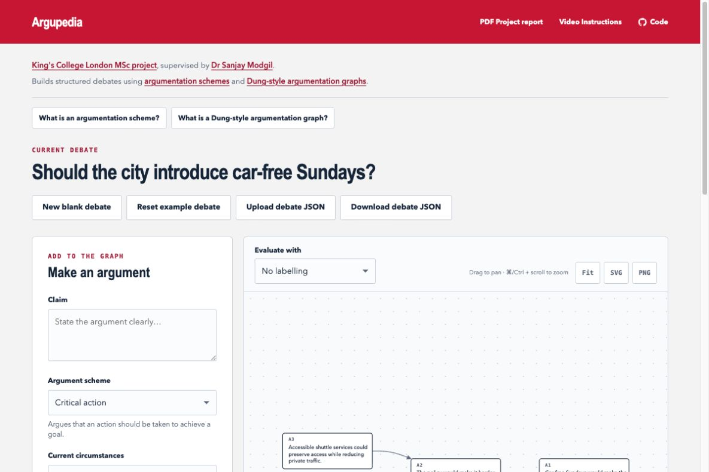
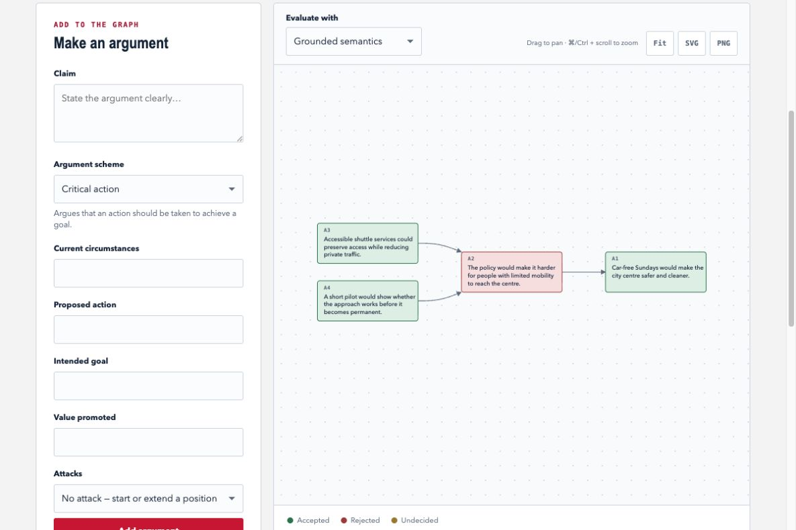

# Argupedia

**Structured debate, mapped.** Argupedia guides people through building arguments and counterarguments, renders their relationships as an interactive argumentation graph, and evaluates the framework using grounded, complete and preferred semantics.

> **Archived project.** This repository preserves a restored version of the 2021 MSc prototype and is not under active development.

[Open the live demo](https://humphreycurtis.github.io/Argupedia/) · [Read the MSc report](./public/docs/Argupedia-MSc-Project-Report-2021.pdf) · [Watch the original demonstration](https://youtu.be/1BaNoLEGmrU)



## Why Argupedia?

Most online debate is arranged chronologically: comments pile up, relationships between claims become difficult to follow, and popularity can be mistaken for justification. Argupedia explores a different model. People construct arguments using established schemes, direct counterarguments at specific claims, and inspect the resulting debate as a graph.

The project was developed in 2021 for the [Advanced Computing MSc](https://www.kcl.ac.uk/study/postgraduate-taught/courses/advanced-computing-msc) at [King's College London](https://www.kcl.ac.uk/), under the supervision of [Dr Sanjay Modgil](https://www.kcl.ac.uk/people/sanjay-modgil/).

## How it works

1. **Structure an argument.** Choose one of eight argumentation schemes and supply its relevant components.
2. **Challenge a claim.** Direct a new argument at an existing one. Argupedia surfaces critical questions appropriate to the target's scheme.
3. **Read the graph.** Claims become nodes and attacks become directed edges. Directly conflicting claims create attacks in both directions.
4. **Evaluate the framework.** Apply grounded, complete or preferred semantics to distinguish accepted, rejected and undecided arguments.

The conceptual foundation combines [argumentation schemes and critical questions](https://philosophicaldisquisitions.blogspot.com/2010/03/argumentation-schemes-part-1.html) with [Dung-style argumentation frameworks](https://en.wikipedia.org/wiki/Argumentation_framework). A semantics does not declare which person has objectively “won”; it identifies defensible sets of arguments under a formal interpretation of their attack relationships.



## Features

- Eight argument schemes with contextual critical questions
- Interactive, pannable and zoomable directed debate graphs
- Correct grounded, complete and preferred semantics
- Multiple-extension navigation where a framework has several defensible positions
- Automatic browser-only saving with no account or server
- Separate controls for starting a blank debate and restoring the example
- Versioned JSON import and export for sharing editable debates
- Complete SVG and high-resolution PNG graph export
- Responsive, keyboard-accessible interface

## Debate files and privacy

Argupedia runs entirely in the browser. The current debate is stored in `localStorage`; it is not uploaded or visible to anyone else. **Download debate JSON** creates a portable, editable debate file. **Upload debate JSON** opens one of those files locally after validating its structure.

JSON is the canonical interchange format. SVG and PNG exports are visual snapshots of the currently selected semantics and extension.

## Semantics and limits

- **Grounded:** the unique least complete extension; deliberately sceptical.
- **Complete:** every admissible extension containing all arguments it defends.
- **Preferred:** the maximal admissible extensions.

Complete and preferred semantics can require exponential computation. This browser edition evaluates them for frameworks of up to 20 arguments. Grounded semantics remains available for larger imported debates.

## Development

Requires Node.js 20.19+ or 22.12+.

```bash
npm install
npm run dev
```

Then open the local URL printed by Vite.

```bash
npm test
npm run build
npm run preview
```

The application uses vanilla JavaScript, [D3](https://d3js.org/) for graph interaction, [Dagre](https://github.com/dagrejs/dagre) for directed layout, Vite for the static build, and Vitest for semantics tests. GitHub Actions publishes `main` to GitHub Pages.

## Research context

The original prototype used Firebase Cloud Firestore as a shared argument repository and was evaluated against Debate.org in a four-participant pilot study. All four participants reported learning more about argumentation, logic and debate; the study also identified pragmatic usability issues and the need for wider testing. The restored edition replaces the retired backend with portable browser storage and corrects the distinction between grounded, complete and preferred semantics.

The [full project report](./public/docs/Argupedia-MSc-Project-Report-2021.pdf) documents the literature review, design process, implementation, argument graphs and evaluation. Historical implementation details remain available in Git history.

## Licence

Released under the [MIT Licence](./LICENSE). The report remains © Humphrey Curtis.
